### Sunny Blue Shark Run

Sharkle is a canvas-based underwater adventure game. Guide Sharkie through a hazardous ocean, collect the scattered coins and poison capsules, survive hostile sea creatures and barriers, then use poisonous bubbles to defeat the final boss.

<p align="center">
	<a href="https://sharkle-game.vercel.app/">
		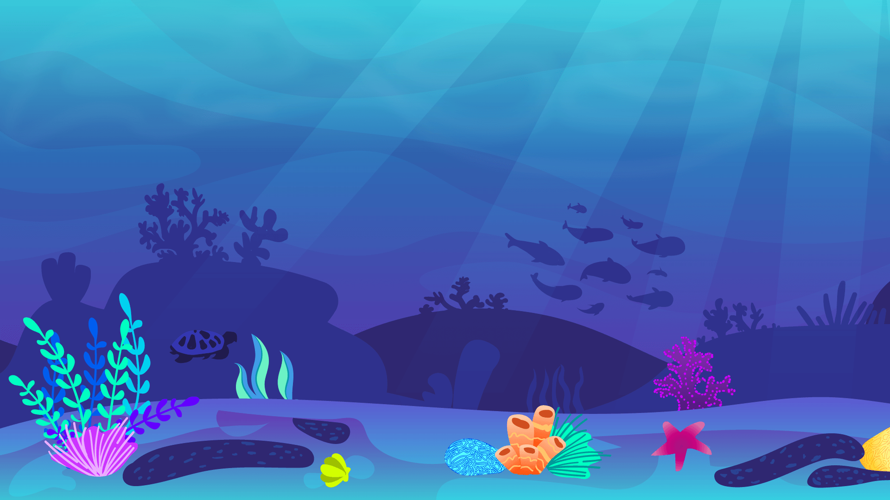
	</a>
</p>

<p align="center">
	<a href="https://sharkle-game.vercel.app/">Play Sharkle live</a>
</p>

## Play Online

The deployed game is available here:

**[Launch Sharkle](https://sharkle-game.vercel.app/)**

For the best experience, use a current desktop browser, enable sound, and play in a wide window. The game scales its 1920 x 1080 canvas to fit the available viewport.

## How To Play

1. Open the live link and select **Let's Play**.
2. Review the controls tutorial, then select **Let's go!** to release Sharkie.
3. Swim through the level, avoid barriers, and collect items.
4. Collect all **5 poison capsules** to unlock poisonous bubbles.
5. Reach the boss area and use poisonous bubbles to reduce the boss health bar to zero.
6. Collect as many of the **20 coins** as possible before winning.

The game has two outcomes: the win screen reports the collected coin total, while the death screen lets you restart the level immediately.

## Controls

| Action | Keyboard input |
| --- | --- |
| Swim left | `Left Arrow` |
| Swim right | `Right Arrow` |
| Jump / move vertically | `Space` or `Up Arrow` |
| Shoot a bubble | `X` |
| Fin slap | `Y` |
| Toggle sound effects | Sound button in the top-right menu |
| Toggle music | Music button in the top-right menu |
| Reopen controls | Controller button in the top-right menu |

Sound and music preferences are stored in browser `localStorage`, so the mute state is remembered between sessions on the same browser.

## Gameplay Systems

### Exploration

The level scrolls horizontally as Sharkie moves through layered underwater scenery. The world is built from repeating 1920-pixel background sections so the environment continues smoothly across the play space.

### Health and recovery

Sharkie begins with 100 health and can recover up to a maximum of 200 health. Hearts restore 25 health. Damage briefly grants invincibility and triggers a type-specific hurt animation. Health reaches zero only after a fatal hit, which starts the death sequence.

### Collectibles

- **Coins:** 20 coins are placed throughout the level and counted in the HUD and win screen.
- **Poison capsules:** 5 capsules are required to unlock poisonous bubbles.
- **Hearts:** Health pickups are placed at varied positions to reward exploration and careful movement.

### Enemies and hazards

- **Pufferfish:** Move horizontally, change direction, and transition between small and large swimming states.
- **Regular jellyfish:** Float vertically and can be defeated with normal bubbles.
- **Electric jellyfish:** Move vertically and horizontally, damaging Sharkie on contact.
- **Barriers:** Static environmental obstacles force the player to manage vertical movement and timing.

### Final boss

At the end of the level, the boss enters with a dedicated introduction animation and boss music. Regular enemies are cleared from the scene, the boss health bar appears, and the boss attacks at regular intervals by moving toward Sharkie's vertical position. Only poisonous bubbles can damage the boss, so collecting all poison capsules is essential.

## Animation Showcase

Sharkle uses numbered sprite frames and the browser canvas renderer to create character, enemy, item, and boss animations. The main animation groups currently include:

| Character or object | Animation frames | Purpose |
| --- | ---: | --- |
| Sharkie idle | 18 | Waiting and floating |
| Sharkie swim | 5 | Horizontal movement |
| Sharkie bubble attack | 4 | Bubble firing |
| Sharkie fin slap | 3 | Close-range attack |
| Sharkie hurt | 1 to 5 | Normal, electric, and poison damage reactions |
| Sharkie death | 8 | Defeat sequence |
| Pufferfish | 5 per swim state | Small, transition, and large states |
| Jellyfish | 4 | Regular and electric swimming |
| Boss | 4 to 13 | Intro, floating, attack, hurt, and death states |
| Poison capsule | 8 | Animated collectible |

### Sprite frame samples

<p align="center">
	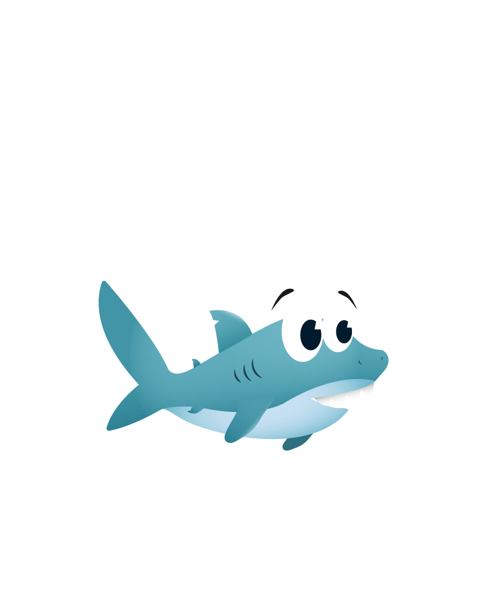
	
	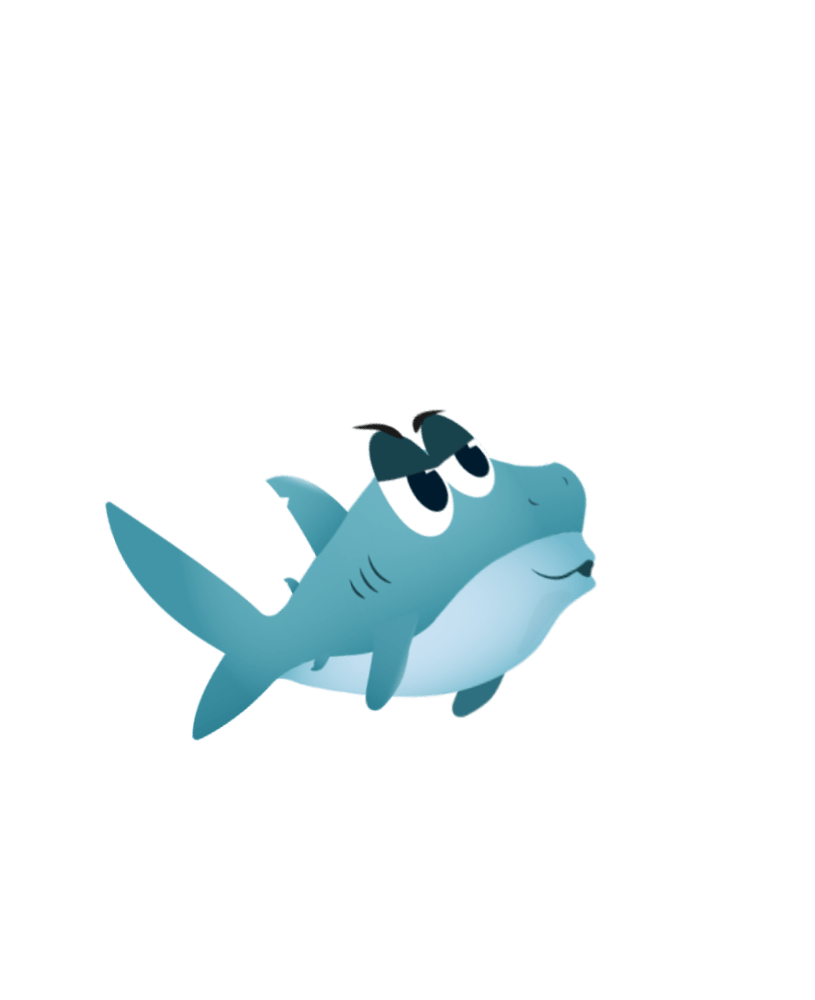
	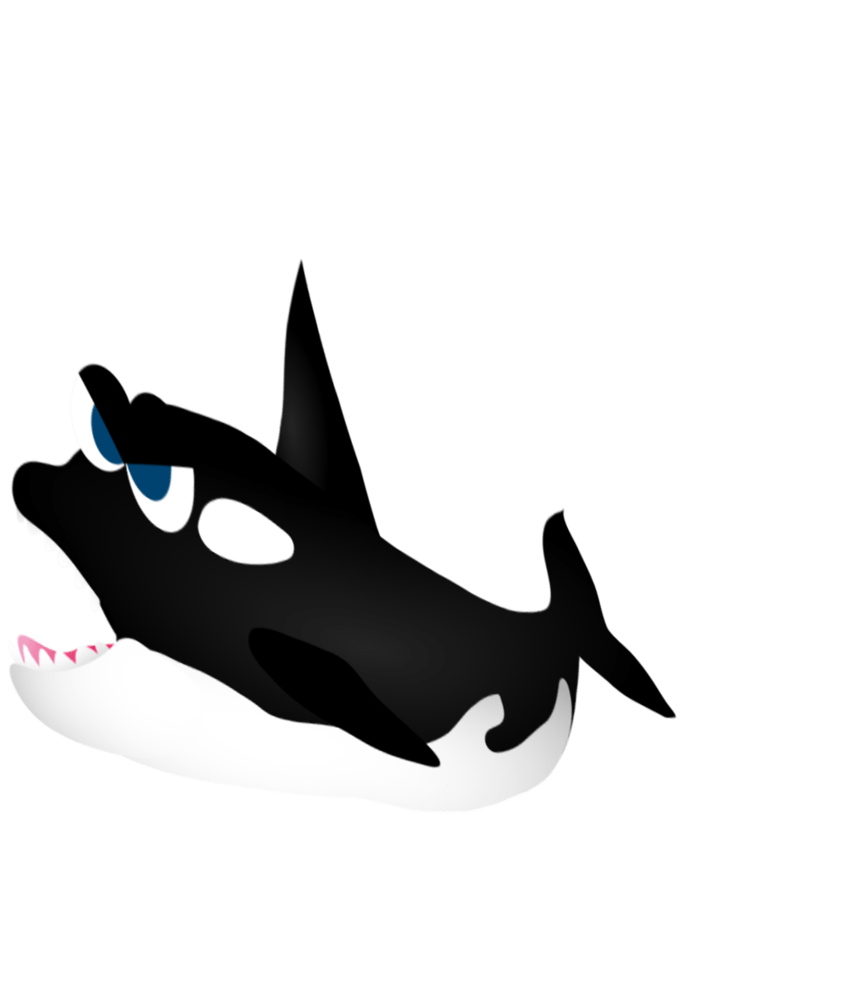
	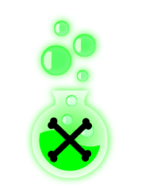
</p>

The frame folders are available in [`assets/`](assets/). Animation loading and frame playback are implemented through the shared object classes in [`game/object.class.js`](game/object.class.js) and [`game/movable-object.class.js`](game/movable-object.class.js).

## Live Gameplay Walkthrough

These screenshots were captured one by one from a local running build of Sharkle. Open each panel to follow the playable sequence, or click any image to jump directly into the deployed game.

<p align="center">
	<a href="https://sharkle-game.vercel.app/"><strong>▶ Play the live animated game</strong></a>
</p>

<details open>
	<summary><strong>Frame 1: Opening screen</strong></summary>

	<a href="https://sharkle-game.vercel.app/">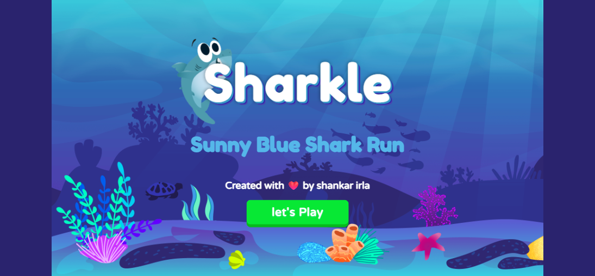</a>

	The title screen introduces Sharkle and starts the first audio and tutorial interaction.
</details>

<details>
	<summary><strong>Frame 2: Controls tutorial</strong></summary>

	<a href="https://sharkle-game.vercel.app/">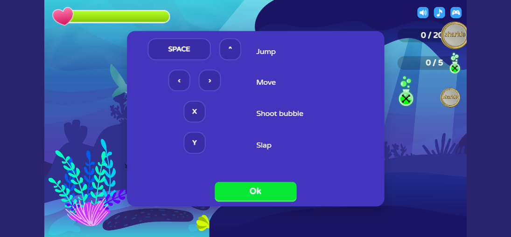</a>

	The tutorial explains movement, jumping, bubble shooting, and the fin slap before gameplay is released.
</details>

<details>
	<summary><strong>Frame 3: Poison quest</strong></summary>

	<a href="https://sharkle-game.vercel.app/">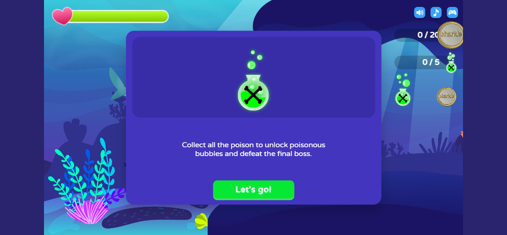</a>

	The quest screen establishes the objective: collect every poison capsule to unlock the attack needed for the final boss.
</details>

<details>
	<summary><strong>Frame 4: Gameplay begins</strong></summary>

	<a href="https://sharkle-game.vercel.app/">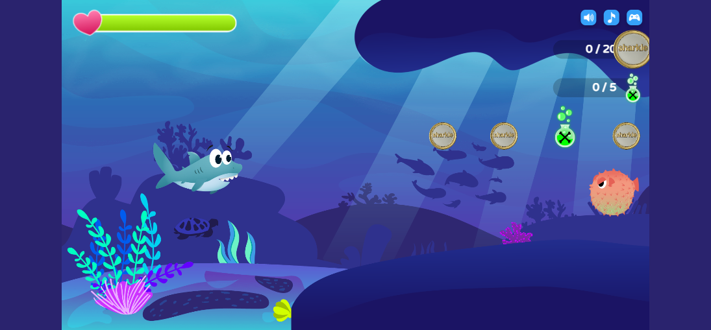</a>

	The HUD shows health, coin progress, poison progress, audio controls, and the first stretch of the underwater level.
</details>

<details>
	<summary><strong>Frame 5: Live action</strong></summary>

	<a href="https://sharkle-game.vercel.app/">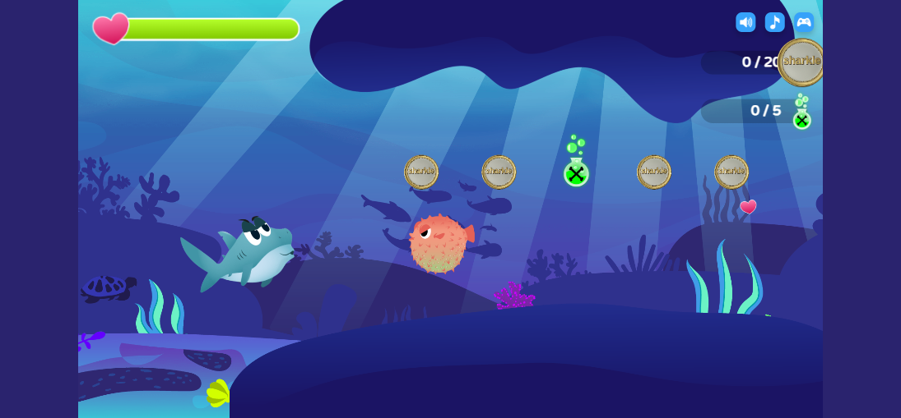</a>

	This runtime frame follows movement, a jump, and a bubble attack. The canvas continues updating every animation frame while GSAP drives enemy and projectile motion.
</details>

### Animation and interaction map

| README element | Interaction |
| --- | --- |
| **Play the live animated game** | Opens the deployed playable build |
| Screenshot images | Open the live game when clicked |
| Expandable frame panels | Reveal each screen in sequence without making the page excessively long |
| Sprite frame samples above | Show the individual images used to build in-game animations |

The captured walkthrough files are stored in [`assets/screenshots/`](assets/screenshots/), so they can be reviewed or replaced independently from the game code.

## Audio and Motion

The game combines sprite animation with GSAP motion for movement and presentation effects:

- Main gameplay music fades in when a run starts.
- Boss music fades from the main track when the boss is introduced.
- Jumping, bubble creation, bubble popping, attacks, damage, collection, death, and victory have dedicated sound effects.
- The opening title uses a breathing animation and the menu fades into the game.
- Tutorial, victory, death, boss introduction, and enemy movement use timed transitions.
- Sound effects and music can be muted independently from the in-game menu.

## Technical Overview

Sharkle is a dependency-light browser game built with:

- HTML for the game shell and HUD overlays
- CSS for layout, responsive scaling, menus, health bars, and UI transitions
- JavaScript ES modules for game state and entity behavior
- HTML5 Canvas for rendering the world every animation frame
- GSAP 3.8 for timed movement, fades, enemy motion, and boss presentation

### Game flow

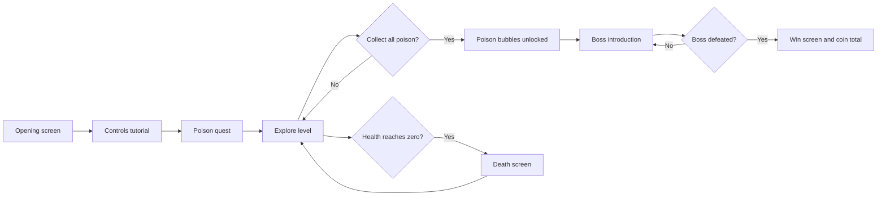

### Project structure

```text
.
├── index.html                 # Game shell, HUD, menus, and canvas
├── script.js                  # Game entry point
├── style.css                  # Layout, responsive UI, and CSS animation
├── assets/                    # Sprite frames, backgrounds, icons, and audio
└── game/
		├── game.class.js          # Main loop, lifecycle, and asset loading
		├── world.class.js         # Camera, drawing order, and world updates
		├── level.class.js         # Entities, placements, and background sections
		├── ui.class.js            # HUD, tutorial, audio controls, and result screens
		├── object.class.js        # Shared image and animation behavior
		├── movable-object.class.js
		├── entities/              # Sharkie, boss, enemies, items, and barriers
		└── utils/                 # Drawing, events, sounds, and event emitter helpers
```

## Run Locally

Because the game uses JavaScript modules, serve the folder over HTTP instead of opening `index.html` directly with a `file://` URL.

### Option 1: Python

```bash
cd sharkle
py -m http.server 8000
```

Open [http://localhost:8000](http://localhost:8000) in your browser.

### Option 2: Node.js

```bash
cd sharkle
npx serve .
```

Open the local URL printed by the command.

## Course and Credits


| Author | **I G Siva Shankar** |
| Live deployment | [sharkle-game.vercel.app](https://sharkle-game.vercel.app/) |

Sharkle is an academic game project created to demonstrate browser game development, canvas rendering, object-oriented JavaScript, sprite animation, collision handling, audio feedback, and responsive UI design.

## Author

**Irla Ganga Siva Shankar** is the creator of Sharkle. The author credit is displayed on the opening screen and the project history identifies the author as `shankar-irla`.

Add your preferred contact links below when publishing the project portfolio version:

- Portfolio: `https://shankar-irla.vercel.app/`


